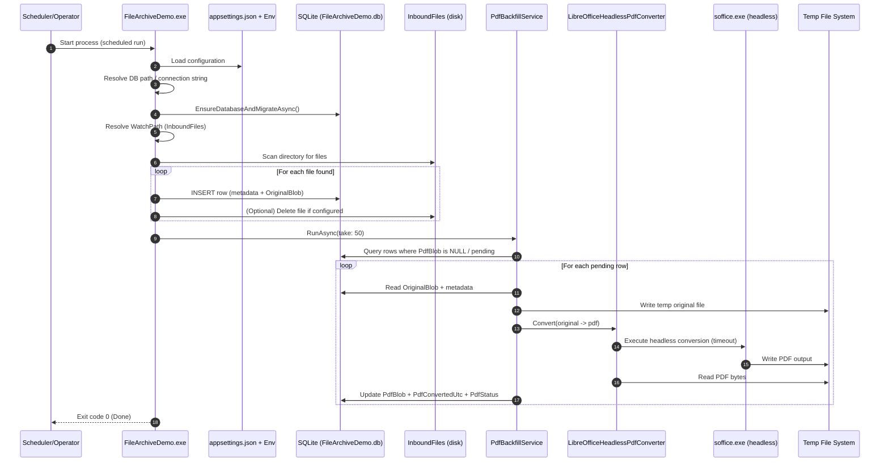

Here’s a set of talking points you can use tomorrow that hits the “decision makers need to decide” message **firmly but professionally**, while showing you’ve already de-risked the work with a working demo.

---

## Your opening (30–60 seconds)

* “We have a working pipeline and a working demo environment. The remaining blocker is not engineering—it’s **an organizational decision** about the approved conversion approach.”
* “I want to leave today with a **clear decision and owner** so we don’t keep cycling on implementation paths that later get rejected.”
* “I’m not asking anyone to read code. I’m asking for a **choice** so I can deliver safely and predictably.”

---

## What’s already proven (show competence + reduce anxiety)

* “The end-to-end flow works today: ingest → store original → convert → store PDF → verify results.”
* “I can demonstrate this live:

  * Drop files in `InboundFiles`
  * Run the console app
  * Show database updates
  * Show PDF bytes populated
  * Download original/PDF from the demo viewer”
* “This proves: the database integration, scheduled-style batch behavior, and backfill logic are solid. The only question is the conversion engine we’re allowed to use in production.”

---

## Frame the decision (make it *their* call, not yours)

* “We have 2–3 viable conversion strategies. Each has different tradeoffs (cost, security posture, operational complexity, data residency).”
* “I can implement any of them—but I need decision makers to pick one, because **engineering can’t ‘approve’ a licensing or cloud data path**.”
* “If we don’t decide, the project stalls and we lose calendar time while risk stays the same.”

---

## The options (say this like a menu)

### Option 1: On-prem conversion using LibreOffice headless (what you have now)

* **Pros**

  * Works today (demonstrated).
  * No subscription procurement.
  * Fully on-prem; no cloud dependency.
* **Cons**

  * Requires LibreOffice installation somewhere (even if isolated).
  * Security concerns often focus on “installable software on servers.”
  * Operational hardening required (timeouts, sandboxing, patching cadence).

**Ask to leadership/security:**
“Is LibreOffice headless acceptable on production servers, or must it be isolated (dedicated box/container), or not allowed at all?”

---

### Option 2: Commercial library (Aspose or equivalent)

* **Pros**

  * Usually best fidelity and predictable behavior.
  * No desktop suite dependency.
  * Cleaner operational footprint than a full office runtime.
* **Cons**

  * Requires procurement + licensing approval (and possibly subscription model).
  * The previous attempt stalled here.

**Ask to leadership/procurement:**
“If we choose a commercial converter, can we approve licensing for production—and who owns that approval?”

---

### Option 3: Microsoft cloud conversion (Graph / M365)

* **Pros**

  * No server-side office runtime.
  * High fidelity for Office documents in many orgs.
  * Moves the conversion into a managed service.
* **Cons**

  * Requires a policy decision on **data leaving environment** (even if it’s “still Microsoft”).
  * Depends on tenant configuration, auth, and possible rate limits/quotas.
  * Needs confirmation which file types are supported and allowed for your data classification.

**Ask to leadership/security:**
“Is Microsoft cloud conversion permitted for these documents? If yes, under what constraints (tenant, region, retention, logging, allowed file types)?”

---

## The “I need a decision” moment (firm, not threatening)

Use phrasing like:

* “To keep momentum and avoid rework, I need **a decision this week** on which conversion path is approved for production.”
* “If this decision isn’t made, I can keep improving the demo, but we’ll be blocked on shipping because the production approach won’t be authorized.”
* “I’m happy to implement any option—my risk is spending engineering time on a path that later gets rejected. I need leadership to own the approval decision.”

If you want a more direct line that still stays professional:

* “I don’t want this to become a situation where engineering is held accountable for a decision that only security/procurement can make. I need the approving stakeholders to make the call.”

---

## A simple decision proposal (gives them an easy “yes”)

Offer a two-track plan:

* “**Decision A (preferred)**: Choose the approved production path (LO isolated vs commercial vs M365).”
* “**Decision B (fallback)**: If the preferred path isn’t approved in time, authorize a temporary solution for internal-only conversion or staging—so we keep progress without risking production.”

This makes it easier for them to commit, because you’re giving them a safety net.

---

## Questions you should explicitly ask in the room

1. “Who is the **single decision owner** for the production conversion approach?”
2. “Is **Microsoft cloud conversion** allowed for this document classification?”
3. “If we avoid cloud, are we allowed to run **LibreOffice headless** in production if it’s isolated and patched?”
4. “If we avoid installables, are we willing to approve a **commercial library license**?”
5. “What matters most: **security posture, cost, fidelity, or time-to-ship**? Rank them.”

---

## What you can offer immediately (to look solution-oriented)

* “I can do a quick proof of concept for MS cloud conversion if it’s allowed—just enough to validate auth + a sample conversion.”
* “I can package the on-prem option as an isolated service (tight permissions, timeouts, logging) if that’s the security requirement.”
* “I can provide a one-page comparison matrix if you want a paper trail.”

---

## Your demo narrative (how to show it in 2 minutes)

* “Here’s an input file folder.”
* “Run the console app: it ingests, stores original, and fills `PdfBlob` when missing.”
* “Here’s the DB viewer table showing:

  * original bytes exist
  * PDF bytes exist
  * timestamps/status fields”
* “Here’s the download button: original + PDF.”

This proves the workflow is real and not theoretical.

---

## Basic sequence diagram of the current code

You can paste this into a Markdown file (supports Mermaid if your viewer allows it). Even if Mermaid isn’t supported, it reads well.

---

If you want, I can also give you a **one-slide decision matrix** (Option vs Security vs Cost vs Fidelity vs Ops burden vs Time) that you can paste into your meeting notes.
